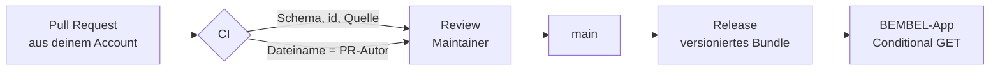

# 🥤 bembel-data

**Frankfurter Kioskkultur als offene Daten — wie Yelp, nur in GitHub.**
Einträge und Bewertungen sind Pull Requests: jeder Eintrag nennt seine Quelle,
jede Bewertung ihren Autor, und die CI prüft beides. Kein Moderator sitzt
dazwischen.

[](LICENSE.md)
[](../../actions/workflows/validate.yml)
[](../../actions/workflows/rating-authorship.yml)


Dies ist die Datenbasis der [BEMBEL-App](https://github.com/maurice-jobst/bembel),
einer kostenlosen iPhone-City-App für Frankfurt und Rhein-Main. Die App hat kein
Backend und keine Konten. Wer beitragen will, tut es hier: öffentlich,
versioniert, nachvollziehbar.

## 🧭 Warum in GitHub und nicht in einer App

Bewertungsportale bitten um Vertrauen und behalten die Belege für sich: Wer hat
das eingetragen, woher stammt die Angabe, wie viele Konten stehen hinter den
Sternen? Hier ist die Antwort jedes Mal ein Commit.

| | |
|---|---|
| 🔍 **Provenienz statt Anonymität** | Jeder Eintrag führt seine Quellen im `sources`-Feld, jede Änderung steht mit Datum und Account im git log. Kein anonymer Sternebrei. |
| ✍️ **Eine Bewertung pro Account** | Der Pfad `data/bewertungen/<eintrag>/<login>.json` lässt pro Eintrag genau eine Bewertung je Konto zu — und die CI weist einen PR ab, der eine fremde Bewertungsdatei anfasst. Niemand bewertet stellvertretend. |
| 🚫 **Kein Backend, keine Konten** | Die App sammelt nichts, weil sie nichts zu sammeln hat. Der App-Store-Datenschutzhinweis sagt „Keine Daten erfasst“, und das stimmt. |

Wer die Regeln nicht glauben will, liest sie als Code:
[`scripts/validate.py`](scripts/validate.py) und
[`scripts/check_authorship.py`](scripts/check_authorship.py). Beide laufen in
der CI bei jedem Pull Request, beide sind reine Standardbibliothek — kein `pip`,
keine Abhängigkeiten.

## 📦 Datensätze

| Ordner | Inhalt | Schema | Status |
|---|---|---|---|
| `data/wasserhaeuschen/` | Frankfurts Kiosk-Kultur: ein JSON pro Wasserhäuschen | [`wasserhaeuschen.schema.json`](schemas/wasserhaeuschen.schema.json) | im Aufbau |
| `data/ebbelwei/` | Traditionelle Apfelwein-Wirtschaften | [`ebbelwei.schema.json`](schemas/ebbelwei.schema.json) | im Aufbau |
| `data/bewertungen/` | Bewertungen, eine Datei pro Eintrag und GitHub-Account | [`bewertung.schema.json`](schemas/bewertung.schema.json) | im Aufbau |

## 🔁 Der Weg eines Beitrags



Ist die CI rot, sagt sie dir in einer Zeile, was fehlt. Ist sie grün, schaut
ein Maintainer nur noch auf Inhalt und Ton.

## ✍️ Mitmachen

**Ein Wasserhäuschen fehlt.** Am einfachsten über das
[Issue-Formular](../../issues/new/choose) — Maintainer machen daraus einen PR.
Wer JSON kann, legt die Datei direkt an: `data/wasserhaeuschen/<slug>.json`
nach Schema, `verified` bleibt `false` (das setzt ein Maintainer nach Prüfung).
Vorlage ist [`yok-yok.json`](data/wasserhaeuschen/yok-yok.json).

**Eine Bewertung abgeben.** Das geht nur aus dem eigenen Account — genau darin
besteht die Zusage, die dieses Repo macht. Lege
`data/bewertungen/<eintrag-id>/<dein-github-login>.json` an und stelle den PR
selbst:

```json
{
  "entry": "yok-yok",
  "login": "deinlogin",
  "stars": 5,
  "date": "2026-08-13",
  "comment": "Nachts um drei die letzte Rettung."
}
```

[Direkt im Browser anlegen →](../../new/main?filename=data/bewertungen/yok-yok/DEIN-LOGIN.json)
(GitHub legt automatisch einen Fork und einen PR an). Aus der BEMBEL-App führt
„Bewerten“ auf denselben Weg, mit vorausgefüllten Feldern.

**Die Regeln, kurz:** Jede Angabe braucht eine Quelle. Keine erfundenen Daten,
keine kopierten Texte, keine Werbung, keine personenbezogenen Daten über
Dritte. `note` und `comment` sind ein sachlicher Satz. Details in
[CONTRIBUTING.md](CONTRIBUTING.md).

## 🛡️ Was die CI prüft

| Regel | Erzwungen durch |
|---|---|
| Datei parst und erfüllt ihr Schema | [`scripts/validate.py`](scripts/validate.py) |
| Jeder Eintrag hat mindestens eine Quelle | Schema (`sources` ist `required`) |
| `id` ist gleich dem Dateinamen | `validate.py` |
| Eine Bewertung referenziert einen existierenden Eintrag | `validate.py` |
| `login` im Dokument ist gleich dem Dateinamen | `validate.py` |
| Der Dateiname einer Bewertung ist der Login des PR-Autors | [`scripts/check_authorship.py`](scripts/check_authorship.py) |
| Höchstens eine Bewertung pro Eintrag und Konto | der Pfad selbst |
| Nichts kommt an diesen Prüfungen vorbei nach `main` — auch kein Maintainer | Branch Protection, gesetzt von [`scripts/apply_branch_protection.sh`](scripts/apply_branch_protection.sh) |

Lokal vor dem Push:

```bash
python3 scripts/validate.py
python3 scripts/check_authorship.py --author "$(gh api user --jq .login)" \
  $(git diff --name-only origin/main...HEAD)
```

## 🚚 Wie die Daten in die App kommen

Releases dieses Repos sind versionierte Daten-Bundles. Gebaut wird jedes Bundle
von [`scripts/build_bundle.py`](scripts/build_bundle.py) — aggregierte
Bewertungen, Provenienz aus der Git-Historie, Abdeckung je Stadtteil, alles aus
dem Repo selbst, byte-deterministisch. Nach jedem Merge auf `main`
veröffentlicht die CI das Ergebnis auf den Branch
[`dist`](../../tree/dist); die App lädt es von dort per Conditional GET
(BEMBEL-Ticket [BEM-S11](https://github.com/maurice-jobst/bembel/issues/46)):

    https://raw.githubusercontent.com/maurice-jobst/bembel-data/dist/bembel-data.json

Ein Snapshot ist in der App gebündelt, damit alles offline funktioniert.
Aggregierte Bewertungen werden hier in der CI berechnet, nicht von einem
Server. Es gibt keinen Server. Wie die App zurück ins Repo verlinkt, steht in
[docs/app-funnel.md](docs/app-funnel.md).

## ❓ Häufige Fragen

**Brauche ich ein GitHub-Konto?**
Für eine Bewertung ja — sie ist an das Konto gebunden, das den PR stellt, und
das ist der Kern des Vertrauensmodells. Ein fehlendes Wasserhäuschen kannst du
auch ohne Konto melden, per Issue-Formular.

**Kann ich eine Bewertung ändern oder zurückziehen?**
Jederzeit, per neuem PR auf die eigene Datei. Löschen zählt als Änderung an der
eigenen Datei und ist erlaubt; fremde Dateien anzufassen ist es nicht.

**Warum eine Bewertung pro Konto und nicht pro Person?**
Weil ein Konto maschinell prüfbar ist und eine Person nicht. Sockenpuppen
bleiben damit möglich. Sichtbar sind sie trotzdem: jedes Konto hat eine
öffentliche Historie, und die steht neben der Bewertung.

**Wem gehören die Daten?**
Niemandem allein. Datenbank und Inhalte stehen unter ODbL 1.0 — nutzbar,
veränderbar, weiterverteilbar, solange die Lizenz mitgeht.

**Was hat die App davon, dass die Daten hier liegen?**
Sie braucht kein Backend, keine Konten und keine Moderationsmannschaft. Was in
einer typischen Bewertungsplattform Server-Logik wäre, ist hier ein Schema, zwei
Skripte und die Git-Historie.

## ⚖️ Lizenz

Datenbank und Inhalte stehen unter der
[Open Database License (ODbL) v1.0](LICENSE.md). Beiträge erfolgen unter dieser
Lizenz. Koordinaten und Angaben aus OpenStreetMap sind ebenfalls ODbL —
Quelle verlinken.

## 🇬🇧 In English

Community-maintained open datasets for Frankfurt and the Rhein-Main region —
kiosk culture (*Wasserhäuschen*) and traditional cider taverns — feeding the
free [BEMBEL](https://github.com/maurice-jobst/bembel) iPhone city app. Entries
and ratings are pull requests. Every entry cites its sources; every rating is
bound to the GitHub account that opened the PR, enforced by CI rather than by a
moderator, so one account leaves at most one rating per entry and nobody rates
on someone else's behalf. No backend, no accounts in the app, no moderation
queue: the review rules are two standard-library Python scripts and the git
history. Data under [ODbL 1.0](LICENSE.md); contributions in German are the
norm, English is welcome.

Built by [Maurice Jobst](https://maurice-jobst.github.io/) as the community
layer of BEMBEL. The same doctrine — AI at the edges, deterministic core — is
written up in [ai-workbench](https://github.com/maurice-jobst/ai-workbench).
